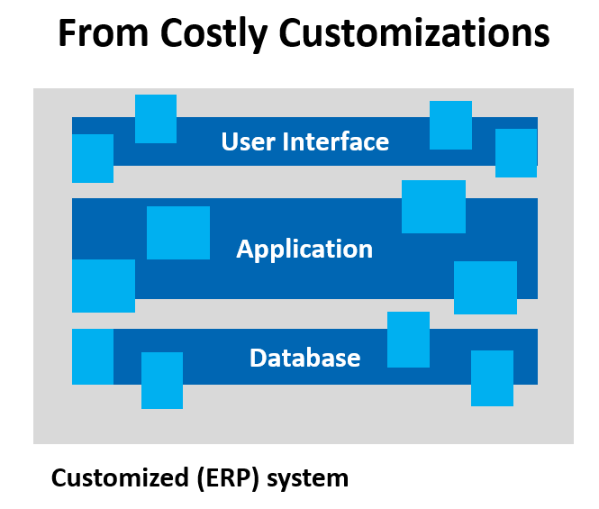
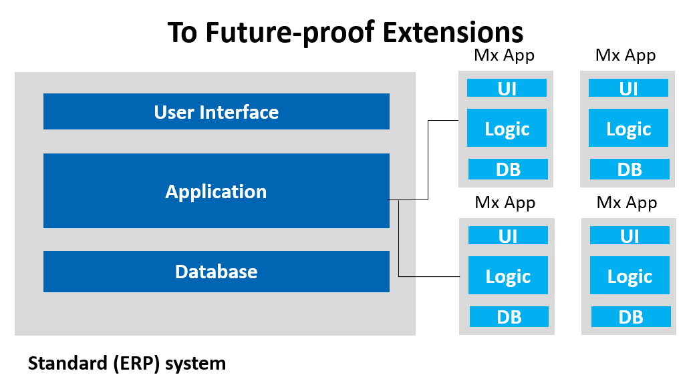

# Extension Pattern

[comment]: # "Clarification on: BP.081"

Many of our core systems are in need of change, either because you're buying a system that doesn't fit your needs completely or because your business is evolving. 

### Reader note
*This document will talk about Core Systems, Monoliths, and legacy systems. When it comes to extending systems there are no difference between any of these types of systems. The extension pattern that we have identified applies to any large existing systems that you want to customize or enhance. This could even be your large Mendix monolithical system you've build 3 years ago and needs an extension.*

Core sytems such as ERPs never cover the full set of business requirements when buying them off the self, there is always the need for customization to fit the organization. However it is important to be aware of the cost and consequences of these customizations.  
The more you customize an ERP the more costly upgrades and future changes will become, since large systems will become more expensive to maintain over time.   

When considering new or changes in workflow it's important to consider your organizational agility and design your workflows in a future proof way. The best way to achieve the most value and flexbility is to take our learnings from Microservices. Using smaller systems dedicated to a specific business process that are easy to create, change or replace.    

## Criteria
* Business Value 
* Implementation Effort 
* Maintenance Effort
* ROI

* Architectural agility

##TODO Write better explanation and business case on why this pattern is relevant and how it aligns with Criteria

## Common Anti-Patterns 
In our software career we've been drilled to re-use everything and get the largest ROI out of our previous investments. It's very common that organizations are looking to get all their moneys worth out of that multi-million dollar investment of their Core system.  
As a result the system should re-use any of the data and logic that is already in the existing system. This is the most common anti-pattern. **Do not re-use your logic and data storage**, this will restrict you in your future ability to maintain or enhance this process.

## Best-Practice

Enhance your Core-system by leaving it as standard as possible (or make the minimal amount of changes).  
>*By limiting work in the core-system there are less to no chances on regression issues. Future upgrades will be significantly faster because of the lack of customization.*  

Bring all logic into the extension, this allows for the visibility and flexibilty in all logic.  
>*When changes are required in the future, only one system needs changing. This limits development effort and regression testing significantly. Any effort rebuilding logic or data structures will be saved later when working on new functionality*

Drive towards future flexibility and value. 
>*Introduce flexibility in your architecture to allow for future changes and adaptability. This will allow future project to be developed with less effort and faster response but also reduces the maintenance effort since the solution is less complex and less complexity means less work*  

Copy data into your extension application and use it as the system of record for the data for that process. 
>*Copy the data into your extension application and allow the application to manage and enrich this data. Push any updates to the master data back but don't attempt to force having all data in a single place. Use (OData) interfaces for easy retrieve of all data.* 

Data exchange between Core and Extension should be limited to milestone stages only.
>*The same data will live in two systems, but it's important to not design the system to have perfect consistency at any given time since that will drastically complicate the solution. Aim to build in certain 'milestones' into the workflow during which data is brought in sync between the two systems. Define which system is leading during what stage to address data discrepencies. This needs to be a simple clear reference list somewhere in the system's documentation.*

Don't create complex data synchronization and merging algorithms. 
>*Consider the following, if users have to interact with and approve data in the Extension but somehow the Core system is able to change the record that is being approved. How can you still rely on the approval being valid. If bi-directional data changes are unpreventable solve this in the workflow rather than the technology, for example: ask the user for a re-approval and highlight the changed fields rather than having complex automatic merge algorithms.*

Apply Microservice principles where possible but accept the need to drop some requirements
>*When building Core extensions it's likely to find the need to develop tightly coupled integrations. For example: Core systems frequently don't have well defined functional APIs. Accept the restrictions that come with the extension and apply Microservice principles where possible but identify and accept where it's not.*

## Example: Order Approval
Scenario: Orders are maintained in an large well known ERP system, all systems that use order information take their information from this system. The approval process needs to be changed into a more fluid workflow by people that should not get full write access to the ERP. Order entry (before this workflow) and order processing (after this workflow) will remain unchanged. 

**Design principles:**
- All unapproved, approved or rejected order data is stored in, and owned by *ERP*
- All 'in-review' order data is stored in, and owned by *Extension*
- Only finalized order data gets pushed towards *ERP* 
- ERP remains unchanged (if possible)
    - New fields that are only relevant during the approving are only stored in *Extension*
    - New order fields or select important audit fields may be added to *ERP*
- Master data gets pulled from *ERP* into *Extension* on demand
    - When using Mendix for the *Extension* attempt to use OData interfaces and Remote Entities
- The *ERP* gets polled on a TBD interval to pull in the new orders and start the workflow
- Status updates get pushed from *Extension* to *ERP* realtime 
- New or changes to Data only need to be present in ERP after approval
- Data discrepancies:
    - during approval workflow, all data in *Extension* is leading.  
    - before or after approval workflow, all data in *ERP* is leading. 
- Order validation is replicated into *Extension* for a seamless user experience

**Solution:**  
The *Extension* application contains all functionality needed for the approval process. On a regular interval the *Extension* queries the *ERP* and retrieves all data relevant for the *Extension*, if new data gets retrieved it will start the workflow. When data is being retrieved all data gets persisted in the database of the *Extension* here the data will live for the same duration as it lives inside *ERP* since only combined they show the complete dataset. The data model should stay close to *ERP* but should be enriched where needed with attributes relevant to the workflow.  
Whenever the order data reaches a milestone status in *Extension* an update can be send to *ERP*, only after completing the workflow all data needs to be brought in sync with *ERP*.
Once the workflow has completed all data gets pushed to *ERP*, depending on the functional requirements of the organization your records in *Extension* are now treated as an immutable archive or the *Extension* constantly pulls the new info from *ERP* ready to re-start the workflow when needed. 
