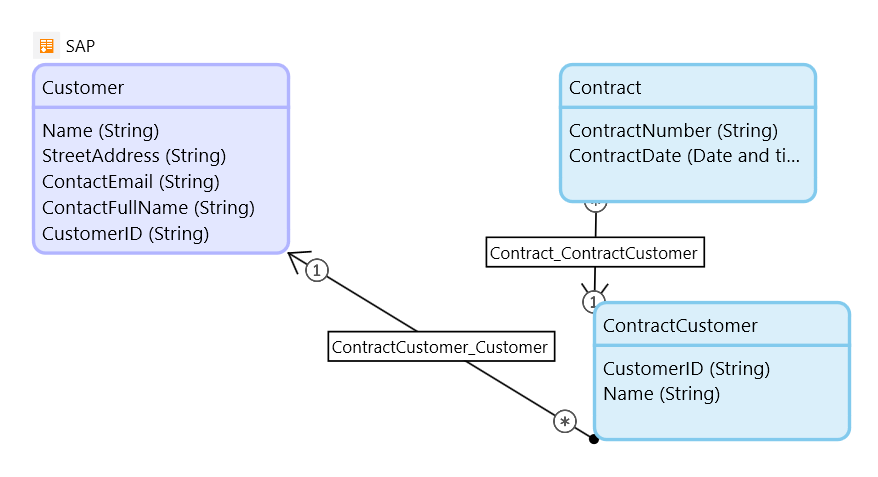
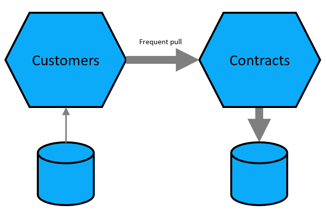
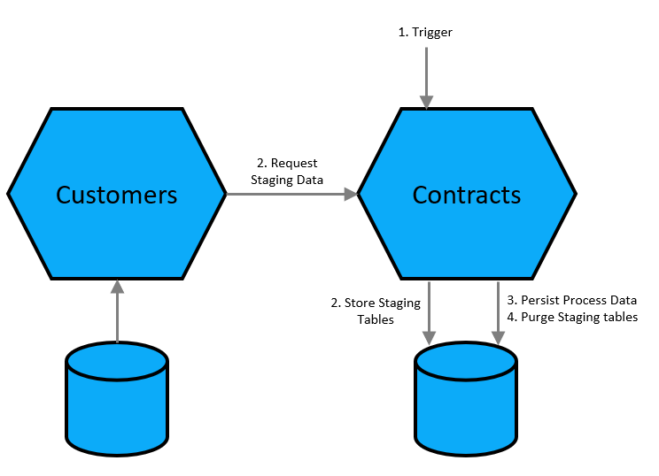

# Integrations: Staging Pattern

[comment]: # "Clarification on: BP.082"

Pattern:
Store only minimal required process data
Temporary Staging tables for full record, through live pull
Data consistency only required for process data

In Mendix:
Remote entities for Staging tables;or depending on integration needs can also be an NPE, or PE with truncate
Separate Persistent Entity for Process Data
Display full Remote entity through nested Dataview when needed. Build error handling!

When the Publishing service is unavailable the user of the system should be able to continue their work with the data that is available in the system. There might be reduced functionality available because of the downtime but that is explainable to the users and limited to a small range of features. 

Always apply this integration pattern when extending a core system to get maximum flexibility and least amount of synchronization challenges.

[comment]: # "^ Reference to: BP.082"

